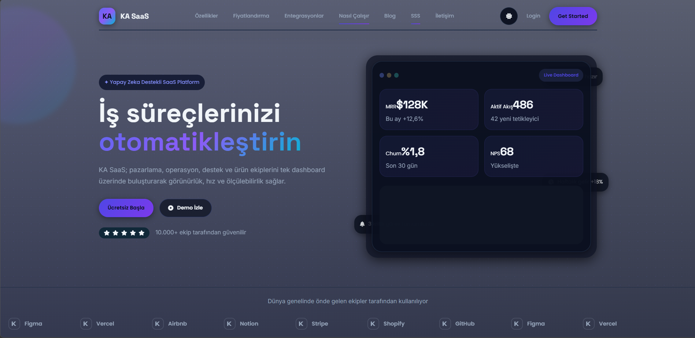

# KA SaaS Landing Page – Free HTML SaaS Template

KA SaaS Landing Page is a modern and responsive HTML landing page template designed for SaaS startups, AI tools, software platforms and digital products.

Built with Bootstrap 5 and modern UI components, this template helps developers and startups launch professional SaaS websites quickly and efficiently.

---

## Live Demo

https://kod-atolye.github.io/ka-saas-landing-page/
https://demo.kodatolye.com.tr/ka-saas-landing-page/

---

## Preview

---

## Features

Modern SaaS landing page design  
Fully responsive layout  
Bootstrap 5 framework  
Clean and developer friendly code  
Dark mode support  
Pricing tables  
Testimonials slider  
FAQ section  
Integration showcase  
Blog layout  
Smooth scroll animations  
Modern UI components  

---

## Pages Included

Home page  
Features page  
Pricing page  
Integrations page  
Blog page  
Blog post page  
Contact page  
Login page  
Register page  
404 page  

---

## Technologies Used

HTML5  
CSS3  
SCSS  
Bootstrap 5  
Vanilla JavaScript  
AOS Animation  
Swiper.js  
Font Awesome  

---

## Installation

1. Download the template files.
2. Extract the project folder.
3. Open the main HTML file in your browser.

You can easily customize colors, layouts and components according to your project needs.

---

## Project Structure

ka-saas-landing-page
│
├ index.html
├ about.html
├ pricing.html
├ features.html
├ integrations.html
├ blog.html
├ blog-post.html
├ contact.html
├ login.html
├ register.html
├ 404.html
│
├ assets
│ ├ css
│ ├ js
│ ├ images
│ └ scss
│
├ screenshot
│ └ preview.png
│
└ README.md

---

## License

This template is free for personal and commercial use.

You are allowed to modify and use this template in your own projects.

Reselling, redistributing or publishing the template files as a paid product is not allowed.

---

## Author

Kod Atölye  
https://kodatolye.com.tr

---

⭐ If you find this project useful, please consider giving it a star on GitHub.
